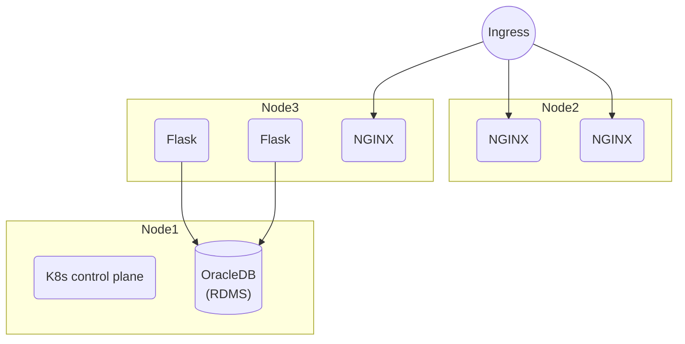

```mermaid
graph TD;

ing((Ingress))

subgraph Node1
	cp("K8s control plane")
	db@{ shape: cyl, label: "OracleDB\n(RDMS)" }
end

subgraph Node2
		n1("NGINX")
		n3("NGINX")
end

subgraph Node3
		f2("Flask")
		f1("Flask")
		n2("NGINX")
end
		
ing --> n3
ing --> n1
ing --> n2
f1-->db
f2 -->db
```