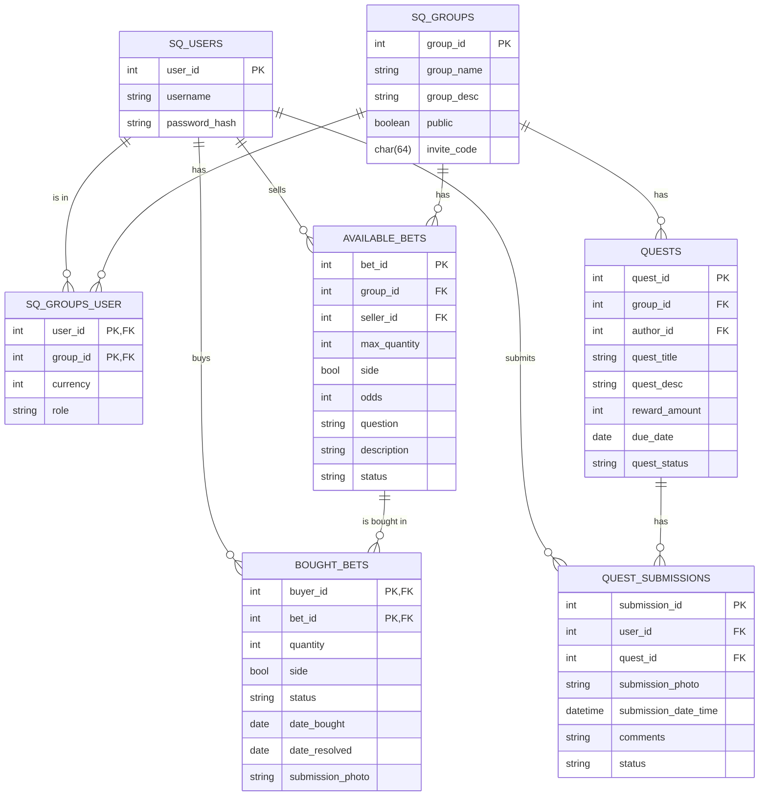

```mermaid
erDiagram
    SQ_USERS {
        int user_id PK
        string username
        string password_hash
    }

    SQ_GROUPS {
        int group_id PK
        string group_name
        string group_desc
        boolean public
        char(64) invite_code
    }

    SQ_GROUPS_USER {
        int user_id PK,FK
        int group_id PK,FK
        int currency
        string role
    }

    AVAILABLE_BETS {
        int bet_id PK
        int group_id FK
        int seller_id FK
        int max_quantity
        bool side
        int odds
        string question
        string description
        string status
    }

    BOUGHT_BETS {
        int buyer_id PK,FK
        int bet_id PK,FK
        int quantity
        bool side
        string status
        date date_bought
        date date_resolved
        string submission_photo
    }

    QUESTS {
        int quest_id PK
        int group_id FK
        int author_id FK
        string quest_title
        string quest_desc
        int reward_amount
        date due_date
        string quest_status
    }

    QUEST_SUBMISSIONS {
        int submission_id PK
        int user_id FK
        int quest_id FK
        string submission_photo
        datetime submission_date_time
        string comments
        string status
    }

    SQ_USERS ||--o{ SQ_GROUPS_USER : "is in"
    SQ_GROUPS ||--o{ SQ_GROUPS_USER : "has"
    SQ_USERS ||--o{ AVAILABLE_BETS : "sells"
    SQ_GROUPS ||--o{ AVAILABLE_BETS : "has"
    SQ_USERS ||--o{ BOUGHT_BETS : "buys"
    AVAILABLE_BETS ||--o{ BOUGHT_BETS : "is bought in"
    SQ_GROUPS ||--o{ QUESTS : "has"
    SQ_USERS ||--o{ QUEST_SUBMISSIONS : "submits"
    QUESTS ||--o{ QUEST_SUBMISSIONS : "has"

```
