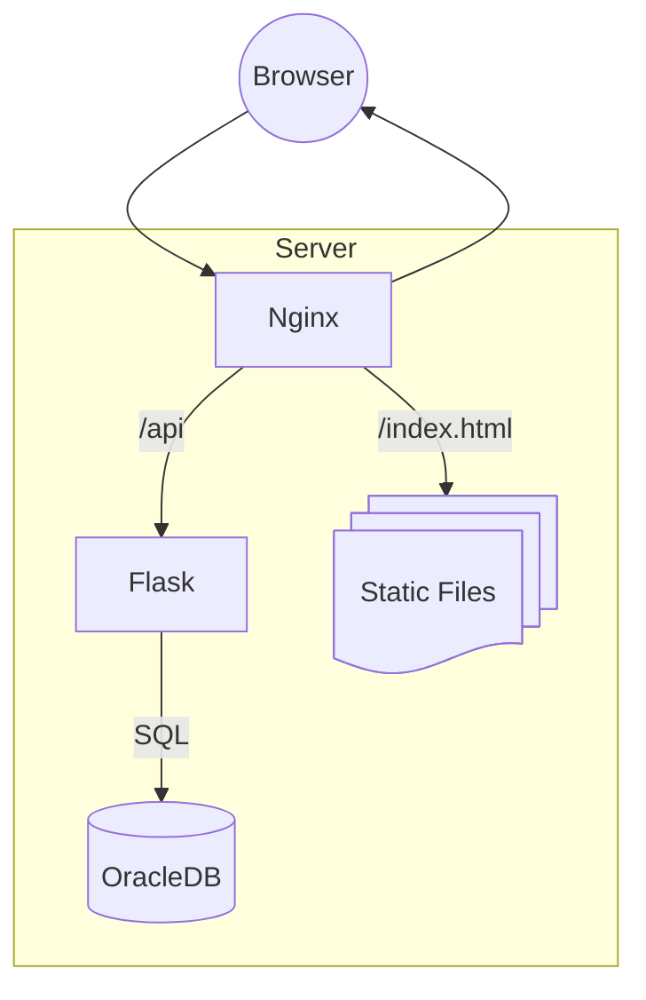

# Infrastructure Design

```mermaid
graph TD;

		Browser((Browser))
    subgraph Server
        Nginx
				Flask
				Database@{ shape: cyl, label: "OracleDB" }
				static@{ shape: docs, label: "Static Files" }
    end

    Browser --> Nginx
    Nginx --> Browser
    Nginx -->|/api| Flask
    Flask -->|SQL| Database
    Nginx -->|/index.html| static


```

