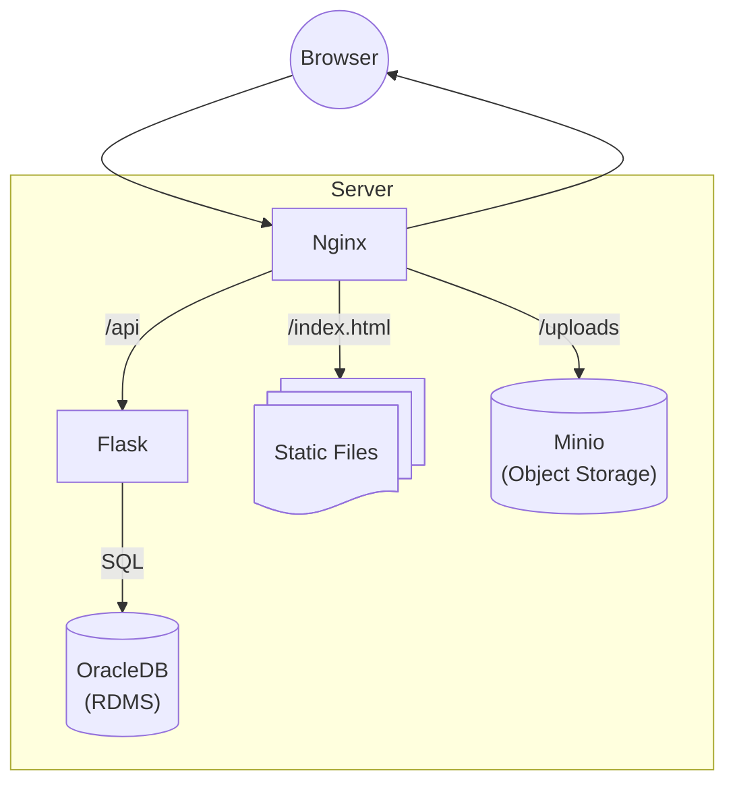

# Infrastructure Design

```mermaid
graph TD;

		Browser((Browser))
    subgraph Server
        Nginx
				Flask
				db@{ shape: cyl, label: "OracleDB\n(RDMS)" }
				static@{ shape: docs, label: "Static Files" }
        obj@{ shape: cyl, label: "Minio\n(Object Storage)" }
    end

    Browser --> Nginx
    Nginx --> Browser
    Nginx -->|/api| Flask
    Flask -->|SQL| db
    Nginx -->|/index.html| static
    Nginx -->|/uploads| obj
```

