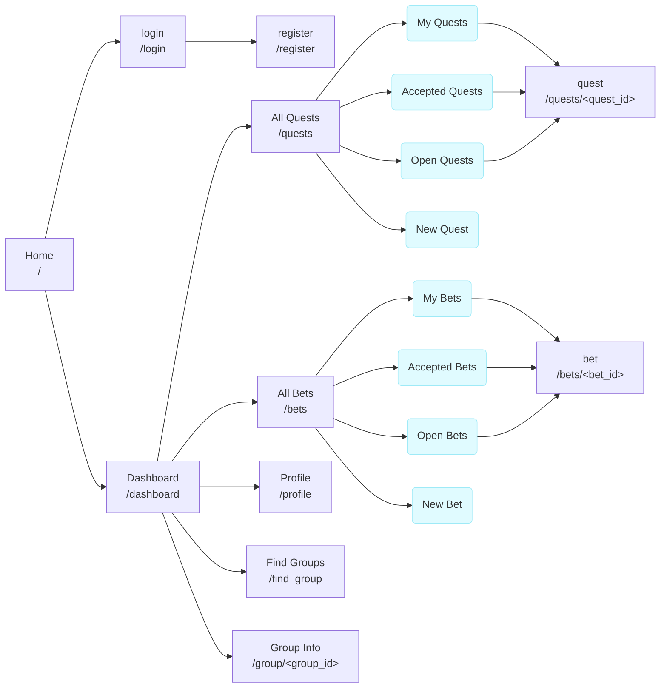

# Site Navigation Map

```mermaid
graph LR;

dash@{ shape: rect	, label: "Dashboard\n /dashboard" }
home@{ shape: rect	, label: "Home\n /" }
q@{ shape: rect	, label: "All Quests\n /quests" }
b@{ shape: rect	, label: "All Bets\n /bets" }
login@{ shape: rect	, label: "login\n /login" }
register@{ shape: rect	, label: "register\n /register" }

mq@{ shape: rounded	, label: "My Quests" }
aq@{ shape: rounded	, label: "Accepted Quests" }
oq@{ shape: rounded	, label: "Open Quests" }
nq@{ shape: rounded	, label: "New Quest" }

mb@{ shape: rounded	, label: "My Bets" }
ab@{ shape: rounded	, label: "Accepted Bets" }
ob@{ shape: rounded	, label: "Open Bets" }
nb@{ shape: rounded	, label: "New Bet" }


quest@{ shape: rect	, label: "quest\n/quests/&lt;quest_id&gt;" }
bet@{ shape: rect	, label: "bet\n/bets/&lt;bet_id&gt;" }

profile@{ shape: rect	, label: "Profile\n /profile" }
find_group@{ shape: rect	, label: "Find Groups\n/find_group" }
group@{ shape: rect	, label: "Group Info\n/group/&lt;group_id&gt;" }

home --> login --> register
home --> dash

dash --> q
dash --> b

dash --> profile
dash --> find_group
dash --> group

q --> mq --> quest
q --> aq --> quest
q --> oq --> quest
q --> nq

b --> mb --> bet
b --> ab --> bet
b --> ob --> bet
b --> nb

classDef react fill:#e0fbff,stroke:#9eeaf7

class mq react;
class aq react;
class oq react;
class nq react;

class mb react;
class ab react;
class ob react;
class nb react;
```

*purple blocks represent pages with dedicated routes, blue blocks represent logical pages that share the route of their parent*
